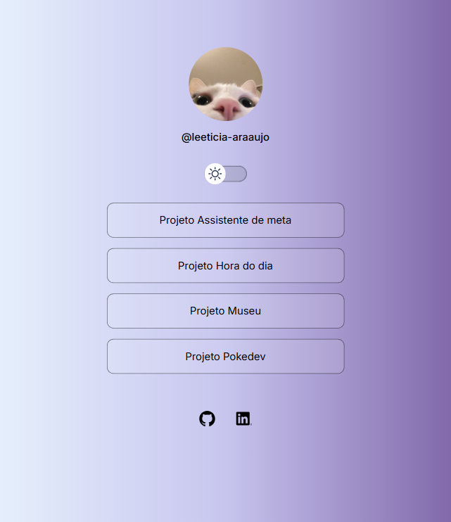

# Meu portifólio 

O portifólio foi inspirado em um desafio de linktree, adaptei para exibir alguns dos meu projetos. Ele possui um light mode e um dark mode, mudando a cor de fundo e a imagem. Foi utilizado HTML para estruturação da página, CSS para estilizar e criar animação para o botão de light/dark mode, e JavaScript para criar a função de mudança de tema.   
Link: [https://leeticia-araaujo.github.io/portifolio/](https://leeticia-araaujo.github.io/portifolio/)

## ☀ Light mode

## 🌙 Dark mode

